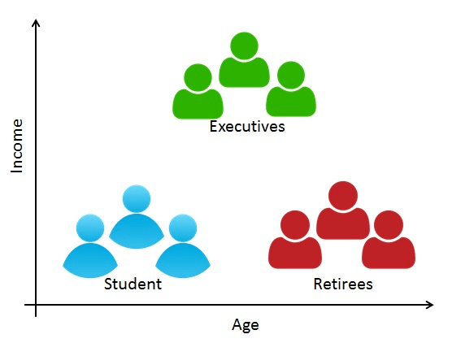

```{r setup, include=FALSE}
knitr::opts_chunk$set(echo = TRUE)
```

# Introduction{.tabset}
Hi there!
In this Data Science and Machine Learning project we are going to perform a customer segmentation. Customer Segmentation is one of the most common practices when it comes to customer analysis and clustering algorithms.

### What is customer segmentation?
<center>

</center>

Customer Segmentation is the practice of dividing a company's customers into groups that have similar characteristics between themselves. The goal of this segmentation is to get to know the different types of customers that the company has and how this customers behaves. Having that information, it becomes possible to create products and marketing specific to each group.

Companies that deploy customer segmentation are under the notion that every customer has different requirements and require a specific marketing effort to address them appropriately. Companies aim to gain a deeper approach of the customer they are targeting. Therefore, their aim has to be specific and should be tailored to address the requirements of each and every individual customer. Furthermore, through the data collected, companies can gain a deeper understanding of customer preferences as well as the requirements for discovering valuable segments that would reap them maximum profit. This way, they can strategize their marketing techniques more efficiently and minimize the possibility of risk to their investment.

#### Benefits of Customer Segmentation

1. More effective marketing strategy
2. Optimize the customer journey
3. Predict customer behavior
4. Personalizing the customer experience
5. Improves customer loyalty and retention
6. Improves conversion metrics
7. Supports product development


### Machine Learning algorithms for Clustering
Regarding the algorithms that will be used in this project, we are going to test two different algorithms:
the K-Means and the k-NN (k-Nearest Neighbors).

**K-Means clustering** is a vector quantization that aims to partition *n* observations into *k* clusters in which each observation belongs to the cluster with the smallest mean distance within the cluster.

The **k-nearest neighbors algorithm (k-NN) classifier** is a non-parametric classification. The input consists of the *k closest* training examples in the data set. The output of the k-NN classifier is a class of membership, just like the k-means. An object is classified by a plurality votes of its neighbors, with the object being assigned to the class most common among its *k nearest neighbors*. That is, a new point of data will be classified as the same class of the majority of the k nearest points in the data set.

Let us start our project!

## Packages

In this project we are going to use some basic packages, like dplyr for data manipulation, RColorBrewer for beautiful colors
and other packages for Machine Learning:

```{r message=FALSE, warning=FALSE}
# RColorBrewer provides us with many beautiful colors
library(RColorBrewer)
# dplyr package will help us when it comes to data manipulation
library(dplyr)
# purrr is a functional programming toolkit that provides new ways of dealing with loops, just like the map() function.
library(purrr)
# the cluster package provides many functions to work with clustering analysis.
library(cluster)
# Enchance our plots
library(grid)
library(gridExtra)
# the NbClust package provides indices for determining the best number of clusters
library(NbClust)
# The factoextra package is a must-have when it comes to extract and visualize multivariate data analysis, such as Principal Component Analysis (PCA) and more.
library(factoextra)
```

## The data
This project's dataset can be downloaded in [this link](https://drive.google.com/file/d/19BOhwz52NUY3dg8XErVYglctpr5sjTy4/view), which also can be found at the [Data-Flair's](https://data-flair.training/) website.

This dataset has 200 observations of 5 different features: CustomerID, Gender, Age, Annual Income and Spending Score. It is a really small dataset but can provides us with a nice exercise on building models.
Let's take a look in a simple summary of the data
```{r message=FALSE, warning=FALSE}
customer <- read.csv('data/Mall_Customers.csv')
str(customer)
summary(customer)
```
This seems to be a tidy dataset. We have a wide range of ages, incomes and spending score. This is will ensure that our model will not have some kind of bias lead by data homogeneity.

```{r}
head(customer)
```

## Exploraty Data Analysis

### What looks like the distribution of the gender occurrences?
To answer that question, we can use a simple bar plot.

```{r message=FALSE, warning=FALSE}
genders <- table(customer$Gender)
barplot(genders,
        main='Gender Distribution of Customers database',
        xlab='Gender',
        ylab='# of Customers',
        col=brewer.pal(name='Dark2', n=2),
        legend=rownames(genders))
```

This bar plot shows us that women buy a bit more than men.

What about the age distribution? We can see the overall age distribution and the age distribution by gender as well.

```{r message=FALSE, warning=FALSE}
par(mar=c(4.1, 4.1, 4.1, 2.1))
hist(customer$Age,
     col='steelblue',
     xlab='Age',
     ylab='# of Customers',
     main= "Distribution of customers ages",
     labels=TRUE)
```


The biggest number of customers ranges from the 15 to 50 years old. This is kind of expected, as in a regular population the number of people in the "working age" should be larger than the older people.
Are there outliers? We can easily check that information by using a box plot.
```{r message=FALSE, warning=FALSE}
boxplot(customer$Age ~ customer$Gender,
        ylab='Age',
        xlab='Sex',
        main='Age distribution by sex',
        col=brewer.pal(2, 'Dark2'))
```

The age amplitude for men is a bit larger than women.


### Annual Income
Now let's take a look about the annual income distribution by gender and by age.
```{r}
# Creating a canvas with 2 axes to plot
par(mfrow=c(1,2))

# Plotting the Female age distribution
hist(filter(customer, Gender=='Female')$Annual.Income..k..,
     xlab='Annual Income (Thousands USD)',
     ylab='# of customers',
     main='Income Distribution for Female',
     col='steelblue',
     breaks=12)

# Plotting the Male age distribution
hist(filter(customer, Gender=='Male')$Annual.Income..k..,
     xlab='Annual Incone (Thousands USD)',
     ylab='# of Customers',
     main='Income Distribution for Male',
     col='steelblue',
     breaks=12)
```


We can also visualize the income as function of age  and gender in the form of a scatter plot:
```{r}
# Transforming the gender into a factor
customer$Gender <- as.factor(customer$Gender)

par(mfrow=c(1,1))
plot(x=customer$Age,
        y=customer$Spending.Score..1.100.,
     pch=16,
     cex=1.5,
     col=customer$Gender,
     xlab='Age',
     ylab='Annual Income (Thousands USD)',
     main='Income distribution by age and sex')

legend('topright', legend=unique(customer$Gender),
       col=c('black', 'red'),
       pch=16)
```

Nice result. The income distribution between men and women are very similar. It is also possible to note that as the people gets older, their salary tends to decrease.

### Spending Score
Now let us take a look at the distribution of the spending score of our customers. For a start, we can make a histogram together with a box plot.

```{r message=FALSE, warning=FALSE}
par(mfrow=c(1,2))

# Plotting a simple Histogram
hist(customer$Spending.Score..1.100.,
     main='Speding Score Histogram',
     xlab='Speding Score',
     ylab='# Of Customers',
     col='steelblue')

# Plotting a box plot of the spending score as function of gender.`
boxplot(customer$Spending.Score..1.100. ~ customer$Gender,
        main='Speding Score Distribution',
        xlab='Gender',
        ylab='Spending Score',
        col=brewer.pal(2, 'Dark2'),
        varwidth=T)
```


The histogram shows that the majority of customers have a median spending score, followed by customers who has or higher or lower and the minor number of customers are in the first and third quantile. Furthermore, the spending score distribution for women is a bit more centralized than for man. A possible explanation for that is, as women usually buys more (the first plot of this section), they tend to increase their score, as man usually buy less and have a sparse score distribution.

The EDA ends here. Now lets to the next section: building the clustering algorithm and identify groups in our data.

## Clustering the Customers

### K-means Algorithm

The first step to use the K-means clustering algorithm is to setup the number of cluster K that we wish to produce the final output.

**Summing up the K-means clustering**

1. We specify the number of clusters that we need to create.
2. The algorithm selects k objects at random from the dataset. This object is the initial cluster or mean. The closest centroid obtains the assignment of a new observation. We base this assignment on the Euclidean Distance between object and the centroid.
3. k clusters in the data points update the centroid through calculation of the new mean values present in all the data points of the cluster. The kth cluster’s centroid has a length of p that contains means of all variables for observations in the k-th cluster. We denote the number of variables with p.
4. Iterative minimization of the total within the sum of squares. Then through the iterative minimization of the total sum of the square, the assignment stop wavering when we achieve maximum iteration.  The default value is 10 that the R software uses for the maximum iterations.

There are a couple of methods for finding the best number of clusters based on the dataset variables and observations, such as the Elbow Method, the Average Silhouette method and the Gap statistic method.

#### Elbow Method

The first step in this method is to create a function that calculates the intra-cluster sum of squares. We can do that using the *kmeans* function.
```{r message=FALSE, warning=FALSE}
# Create a function to calculate total intra-cluster sum of squares
iss <- function(k) {
  kmeans(x=customer[, 3:5],
         centers = k,
         iter.max=100,
         nstart=100,
         algorithm='Lloyd')$tot.withinss
}


# Determine the number of clusters that we want to test
k.values <- 1:10

# Use the map_dbl function to map all the k.values to the function ISS
iss_values <- map_dbl(k.values, iss)

# Plotting the results
par(mfrow=c(1,1))
plot(k.values,
     iss_values,
     type='b', pch=19, frame=F,
     xlab='Number of Clusters K',
     ylab='Total Intra-clusters sum of squares')

# The best value for the clusters number is the one that is closer to the bend of the 'elbow'

k <- 4
```

In the Elbow method, the best number of cluster is determined by the "elbow position" in the graphic, in this case, 4 clusters would the best.

#### Average Silhouette Method
The Silhouette method calculates the average silhouette width. The higher this number is, the better is the algorithm performance.
First we need to calculate the distances for each number of clusters.

```{r message=FALSE, warning=FALSE}
k2 <- kmeans(customer[, 3:5],
             2,
             iter.max=100,
             nstart=50,
             algorithm='Lloyd')
s2 <- plot(silhouette(k2$cluster, dist(customer[, 3:5], 'euclidean')))

k3 <- kmeans(customer[, 3:5],
             3,
             iter.max=100,
             nstart=50,
             algorithm='Lloyd')
s3 <- plot(silhouette(k3$cluster, dist(customer[, 3:5], 'euclidean')))

k4 <- kmeans(customer[, 3:5],
             4,
             iter.max=100,
             nstart=50,
             algorithm='Lloyd')
s4 <- plot(silhouette(k4$cluster, dist(customer[, 3:5], 'euclidean')))

k5 <- kmeans(customer[, 3:5],
             5,
             iter.max=100,
             nstart=50,
             algorithm='Lloyd')
s5 <- plot(silhouette(k5$cluster, dist(customer[, 3:5], 'euclidean')))

k6 <- kmeans(customer[, 3:5],
             6,
             iter.max=100,
             nstart=50,
             algorithm='Lloyd')
s6 <- plot(silhouette(k6$cluster, dist(customer[, 3:5], 'euclidean')))

k7 <- kmeans(customer[, 3:5],
             7,
             iter.max=100,
             nstart=50,
             algorithm='Lloyd')
s7 <- plot(silhouette(k7$cluster, dist(customer[, 3:5], 'euclidean')))

k8 <- kmeans(customer[, 3:5],
             8,
             iter.max=100,
             nstart=50,
             algorithm='Lloyd')
s8 <- plot(silhouette(k8$cluster, dist(customer[, 3:5], 'euclidean')))

k9 <- kmeans(customer[, 3:5],
             9,
             iter.max=100,
             nstart=50,
             algorithm='Lloyd')
s9 <- plot(silhouette(k9$cluster, dist(customer[, 3:5], 'euclidean')))

k10 <- kmeans(customer[, 3:5],
             10,
             iter.max=100,
             nstart=50,
             algorithm='Lloyd')
s10 <- plot(silhouette(k10$cluster, dist(customer[, 3:5], 'euclidean')))
```

Now we make a visualization of the results using the fviz_nbclust() function. This function helps us visualize the optimal number of clusters as follows

```{r}
# Execute the function to get the plot of model performance
fviz_nbclust(customer[, 3:5], # The data
             kmeans,          # the function
             method='silhouette')

```

This method results that 6 is the best number of clusters for our dataset, which is a different value of the previous method.

#### Gap Statistic Method
The Gap Statistic method is quite complex. Its basic idea is to choose the number of K where the biggest variation in the within-cluster distance occurred, based on the overall behavior of uniformly drawn samples.

```{r}
stat_gap <- clusGap(customer[, 3:5],
                    FUN=kmeans,
                    nstart=25,
                    K.max=10, B=50)
fviz_gap_stat(stat_gap)

# It is seems reasonable to choose K=6, as it has been suggested by 2 methods.
print(k6)
```

Printing the model k6 we can see a bunch of information about the model:

1. Cluster: A vector that denotes in each cluster each row of the data frame is.
2. Centers: A matrix that holds the centroids of each cluster (for each feature[column])
3. totss: Total Sum of Squares
4. withinss: This is a vector representing the intra-cluster sum of squares having one componenet per cluster
5. tot.withinss: This denotes the total intra-cluster sum of squares
6. betweens: This is the sum of between-cluster squares
7. size: The total number of points that each cluster holds.

#### Visualizing the Clustering Results using the First Two Principal Components

In order to make a 2D visualization, we have to select 2 of the 3 features that our model was built upon. For this, we run a Principal Component Analysis to select the 2 most important features.

```{r}
pcclust=prcomp(customer[,3:5],scale=FALSE) #principal component analysis
summary(pcclust)
pcclust$rotation[,1:2]

```

We see that the top 2 most important principal components are the Annual Income and the Spending Score. This means that this two features are the ones that most separates the customers.


**Lets visualize the clustering**

```{r}
set.seed(1)

ggplot(customer,
       aes(x=Annual.Income..k..,
           y=Spending.Score..1.100.)) +
  geom_point(stat='identity',
             aes(color=as.factor(k6$cluster))) +
  scale_color_discrete(name=" ",
                       breaks=c('1', '2', '3', '4', '5', '6'),
                       labels=c('Cluster 1', 'Cluster 2', 'Cluster 3', 'Cluster 4', 'Cluster 5', 'Cluster 6')) +
  ggtitle("Segments of Mall Customers",
          subtitle='Using K-means Clustering')
```

But we can explore the clustering result with the third component, the age, as well.

1, Income and Age

```{r}
ggplot(customer,
       aes(x=Annual.Income..k..,
           y=Age)) +
  geom_point(stat='identity',
             aes(color=as.factor(k6$cluster))) +
  scale_color_discrete(name=" ",
                       breaks=c('1', '2', '3', '4', '5', '6'),
                       labels=c('Cluster 1', 'Cluster 2', 'Cluster 3', 'Cluster 4', 'Cluster 5', 'Cluster 6')) +
  ggtitle("Segments of Mall Customers",
          subtitle='Using K-means Clustering')
```

As we can see, the age is not a good parameter for segmenting the customers of this dataset!
2. Spending score and Age

```{r}
ggplot(customer,
       aes(x=Spending.Score..1.100.,
           y=Age)) +
  geom_point(stat='identity',
             aes(color=as.factor(k6$cluster))) +
  scale_color_discrete(name=" ",
                       breaks=c('1', '2', '3', '4', '5', '6'),
                       labels=c('Cluster 1', 'Cluster 2', 'Cluster 3', 'Cluster 4', 'Cluster 5', 'Cluster 6')) +
  ggtitle("Segments of Mall Customers",
          subtitle='Using K-means Clustering')
```

So, the annual income and spending score are the best features to segment our customers.

```{r}
ggplot(customer,
       aes(x=Annual.Income..k..,
           y=Spending.Score..1.100.)) +
  geom_point(stat='identity',
             aes(color=as.factor(k6$cluster))) +
  scale_color_discrete(name=" ",
                       breaks=c('1', '2', '3', '4', '5', '6'),
                       labels=c('Cluster 1', 'Cluster 2', 'Cluster 3', 'Cluster 4', 'Cluster 5', 'Cluster 6')) +
  ggtitle("Segments of Mall Customers",
          subtitle='Using K-means Clustering') 
```

Besides k=6 has been the best number of clusters suggested by the Gap Statistic and the Average Silhouette Method, it seems That the clusters 1 and 2 are really close to each other, i.e, there should be 5 clusters instead of 6. Lets try making it with 5:

```{r}
ggplot(customer,
       aes(x=Annual.Income..k..,
           y=Spending.Score..1.100.)) +
  geom_point(stat='identity',
             aes(color=as.factor(k5$cluster))) +
  scale_color_discrete(name=" ",
                       breaks=c('1', '2', '3', '4', '5'),
                       labels=c('Cluster 1', 'Cluster 2', 'Cluster 3', 'Cluster 4', 'Cluster 5')) +
  ggtitle("Segments of Mall Customers",
          subtitle='Using K-means Clustering') 
```

Now it looks better. But how about the numbers?

```{r}
paste("k5 total withins is: ",k5$tot.withinss)
paste("k6 total withins is: ",k6$tot.withinss)

paste("k5 betweenss is: ",k5$betweenss)
paste("k6 betweenss is: ",k6$betweenss)
```

For k6 we have a smaller number for the total sum of ISS than the k5 model. However, k5 presents a smaller number of between iss than the k6. This should be considered when taking this model into production.

## Conclusion

coming soon...